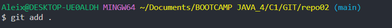
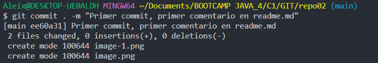
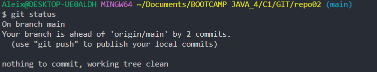

# EJERCICIO 2

## **2.1 - Crea un repositorio llamado repo02 desde GitHub. ¿Sería considerado un repositorio local o remoto?**
### Al crear un repositorio en GITHUB se considera remoto, ya que estan en la misma nube

## Git clone

## Git add .

### Para subir todos los ficheros del repositorio al staying area

## Git commit . para hacer un snapshot de todos los ficheros en el repositorio

## Git status 

### Para poder ver el estado del ciclo de vida de los ficheros

